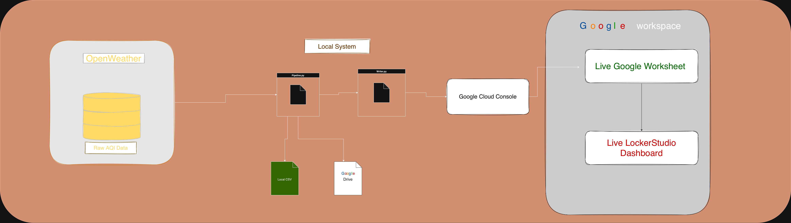
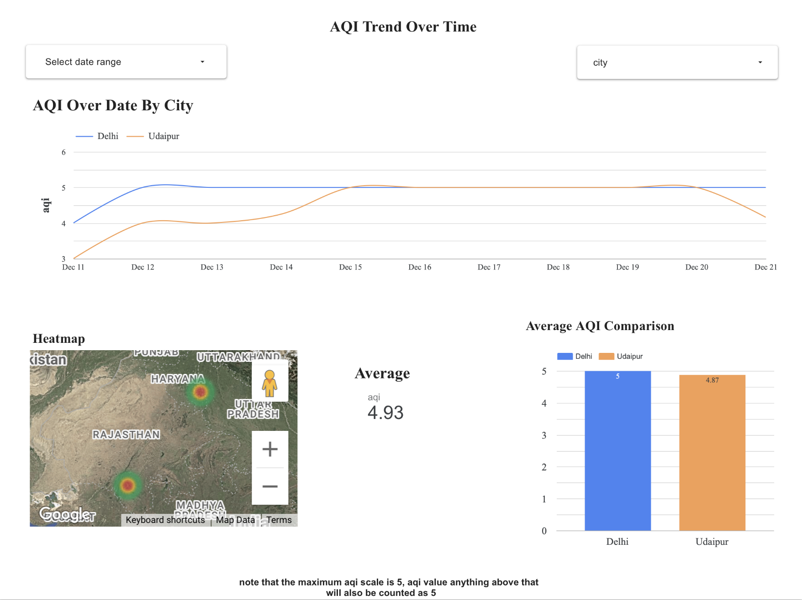
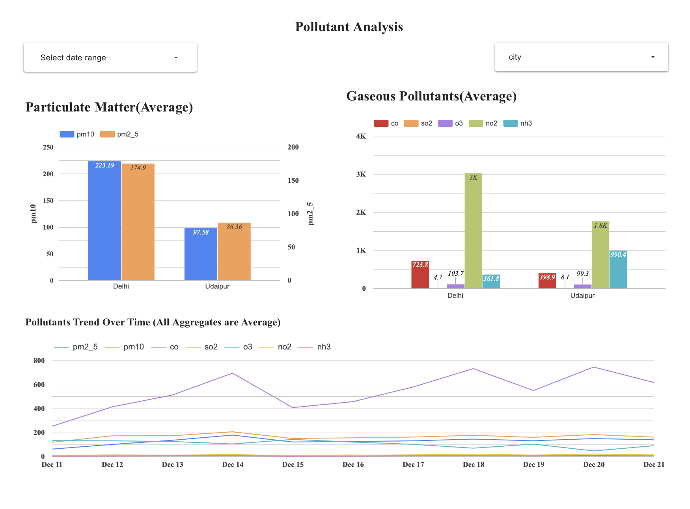

## AQI Analysis & Live Monitoring Pipeline

An end-to-end data engineering and analytics project that automatically collects air quality data, maintains historical records, and presents live analytical insights through a dashboard.

This project focuses on correct data pipelines, reliable storage, and meaningful analytics, not just visualizations.

⸻

## Project Overview

This system continuously fetches Air Quality Index (AQI) and pollutant data for selected Indian cities, stores it as a clean historical dataset, and exposes it to a live dashboard for analysis.

Key goals:
	•	Automate AQI data collection
	•	Preserve historical data (time-series)
	•	Ensure data quality and consistency
	•	Enable real-time analytical dashboards
	
**Note**: AQI values are categorical (1–5) and based on pollutant thresholds. Once the Very Poor threshold is crossed, AQI saturates at 5 even if pollutant concentrations continue to increase. Differences between cities are better understood by comparing individual pollutant levels.

⸻

**Live Dashboard** : https://lookerstudio.google.com/reporting/febbd29c-ea0e-42f7-8d8c-a951bbfe91c0

**Live spreadsheet** :https://docs.google.com/spreadsheets/d/1lbDIBplg5ONuxJjtqAfFaY5IqHj0SAYDNaj0z58xGuc/edit?usp=sharing

> 📄 A production incident and lessons learned are documented in [POSTMORTEM.md](./POSTMORTEM.md)

## Architecture

OpenWeather Air Pollution API

↓

Python AQI Pipeline (scheduled)

↓
			
Local CSV (source of truth)

 ↓

Google Drive (cloud backup)

 ↓
 
Google Sheets (analytics layer)

 ↓
 
Looker Studio (live dashboard)

Each layer has a single responsibility, making the system easy to understand and extend.

**Data Source**
	•	Provider: OpenWeather – Air Pollution API
	•	Data Type: Observational, time-series environmental data
	•	Cities Covered:
	•	Delhi
	•	Udaipur

**Metrics Collected**
	•	AQI index (1–5)
	•	PM2.5, PM10
	•	NO₂, SO₂, CO, O₃, NH₃

⸻

## Design Decisions

- Used a scheduled pipeline instead of manual scripts to ensure continuous
  time-series data collection.

- Treated local CSV files as the source of truth and Google Sheets as a live
  monitoring layer to balance reliability and accessibility.

- Followed an append-only data strategy to preserve historical AQI records
  and enable trend analysis.

- Separated pipeline, dashboard, and data layers to keep the system modular
  and maintainable.

- Prioritized data correctness, logging, and error handling over visual polish
  to reflect production-grade analytics workflows.

## Data Collection Pipeline

Script: aqi_pipeline.py

The pipeline performs the following steps:
	
-   1.	Loads configuration and environment variables
	2.	Validates API connectivity
	3.	Fetches AQI and pollutant data per city
	4.	Handles retries, timeouts, and failures
	5.	Validates and cleans incoming data
	6.	Enriches records with analytical fields:
	•	date, hour, day_of_week, month, year, week_number
	•	aqi_category
	7.	Appends new records to historical CSV
	8.	Ensures newest records always appear at the top
	9.	Logs execution status and metrics

The pipeline is idempotent, fault-tolerant, and reproducible.

⸻

## Scheduling & Automation

- Scheduler: launchd (macOS LaunchAgent)
- Frequency: Configurable (e.g., every 10 minutes)
- Behavior:
	•	Runs automatically while the system is awake
	•	Designed for local development and demos

In production, this scheduler would typically be migrated to a cloud VM or managed scheduler.

⸻

## Data Storage

Local CSV (Source of Truth)
	
- Maintains full historical dataset
- Schema is stable and version-controlled

Google Drive
	
- Cloud backup of the CSV
- Protects against local data loss

⸻

## Google Sheets Sync

Script: google_sheets_writer.py

- Syncs the cleaned dataset to Google Sheets
- Converts data into Google Sheets–compatible format
- Handles:
	•	datetime serialization
	•	NaN / null values
	•	strict JSON constraints
	•	Uses full refresh writes to guarantee consistency

The Google Sheet is treated as a read-only analytics mirror, not a data entry layer.

⸻

## Analytics & Dashboard

Tool: Looker Studio

The dashboard is designed using data analyst best practices, not ad-hoc charts.

Key Pages
	
- Overview: Current AQI snapshot by city
- Trends: AQI time-series analysis
- City Comparison: Average AQI across cities
- Pollutant Analysis: PM2.5, PM10, and gaseous pollutants comparison

Design Principles

- Correct chart selection (grouped bars, time series)
- Meaningful aggregation (average vs raw values)
- Filters for date range and city
- No misleading stacked pollutant charts

⸻

## Data Quality & Validity

Strengths

- Real external data source
- Consistent automated collection
- Timestamped and traceable
- Suitable for monitoring and trend analysis

Limitations

- Dependent on OpenWeather’s sensors and models
- Not regulatory-grade air quality data
- Intended for analytics, not enforcement

These limitations are explicitly acknowledged, which is standard professional practice.

⸻

## Technologies Used
	•	Python (requests, pandas)
	•	OpenWeather API
	•	Google Sheets API
	•	Looker Studio
	•	launchd (macOS)
	•	Git & GitHub

## How to Run Locally

1. Set environment variable
   
       export OPENWEATHER_API_KEY="your_api_key_here"

3. Run pipeline
   
       python3 aqi_pipeline.py

5. (Optional) Enable schedule
   Load the LaunchAgent plist to run automatically.

   📌 Skills Demonstrated
	•	API integration and ETL pipelines
	•	Time-series data handling
	•	Fault-tolerant automation
	•	Data cleaning and enrichment
	•	Analytics-driven dashboard design
	•	Production-aware engineering decisions
